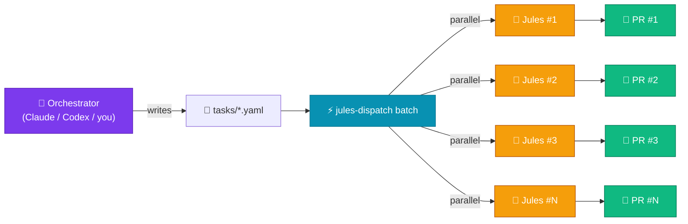
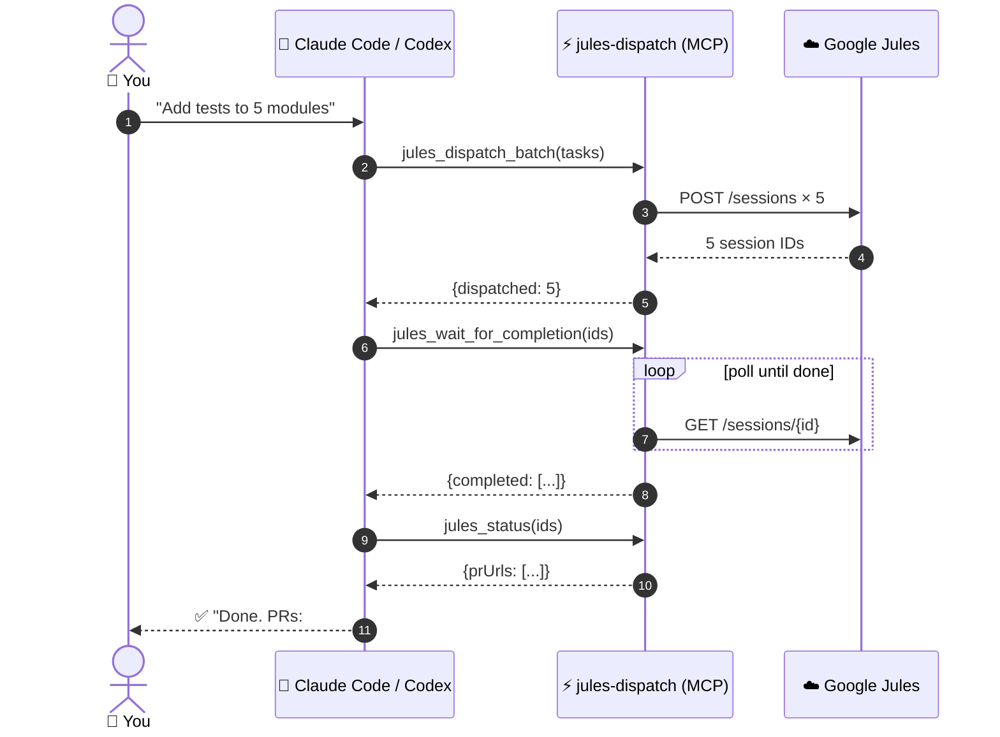
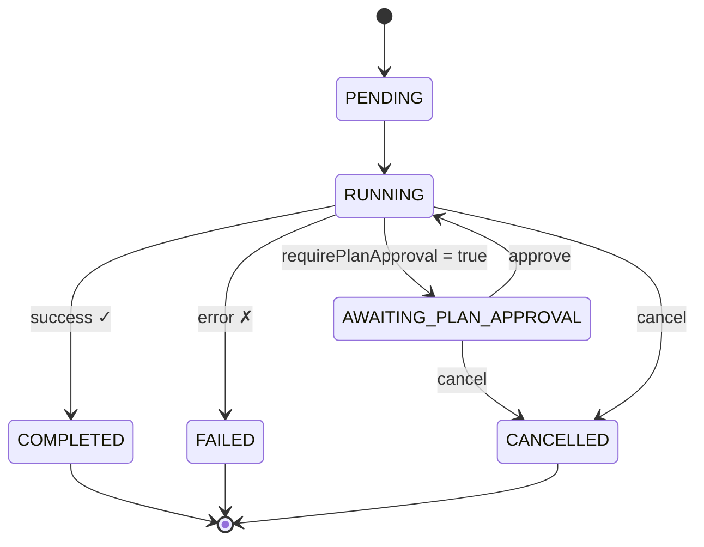

# jules-dispatch 🚀

> **Batch-dispatch tasks to [Google Jules](https://jules.google.com/) in parallel — and use it as an MCP tool inside [Claude Code](https://docs.anthropic.com/en/docs/claude-code) or [OpenAI Codex CLI](https://github.com/openai/codex).**

[](https://www.npmjs.com/package/jules-dispatch)
[](https://www.typescriptlang.org/)
[](https://modelcontextprotocol.io/)
[](LICENSE)

🌐 **Languages**: **English** · [简体中文](README.zh-CN.md)

<p align="center">
  
</p>

---

## What Is This?

**jules-dispatch** is a CLI **and** an [MCP server](https://modelcontextprotocol.io/) for the [Google Jules API](https://jules.google.com/) that lets you:

- Fire off **10–100 Jules coding sessions in parallel** with a single command
- Define tasks as simple **YAML files** — title, repo, branch, prompt
- **Poll for completion** and collect generated PR links
- Approve plans, send follow-up messages, cancel runaway sessions, tail live activity
- Plug into **Claude Code** or **Codex** as an MCP server — your AI assistant calls Jules as a tool

It turns Jules from a "one task at a time" tool into a **massively parallel coding workforce**, controlled by either humans on the CLI or other AIs over MCP.

---

## 🏗 How It Works



---

## ✨ What's New in 1.1

- 🧰 **MCP server** (`jules-dispatch mcp`) — 12 tools exposed to Claude Code, Codex, or any MCP-compatible client
- 🤖 **`--json` mode** — machine-readable output on every command for AI agents and shell pipelines
- ✅ **Plan approval workflow** — `plan`, `approve` commands + `requirePlanApproval: true` task option
- 📡 **Live tailing** — `tail <id>` streams activity events as they happen
- ❌ **Cancel sessions** — `cancel <id>` aborts runaway runs
- 🔍 **Direct lookup** — `get <id>`, `status --ids` no longer limited to the recent page
- 🛡️ **Real failure detection** — uses session.state, fails fast, distinct exit codes
- ⚡ **Smart retries** — exponential backoff with jitter, honours `Retry-After`
- 📥 **Stdin input** — `dispatch -` reads YAML/JSON from a pipe
- 🔑 **`--api-key` flag** — pass keys per-invocation, no .env required

---

## ✨ Key Features

| Feature | Details |
|---|---|
| ⚡ Parallel dispatch | Saturate Jules with N sessions at once (`--parallel 20`) |
| 📋 YAML task files | Multi-document YAML supported (`---` separators) |
| 🔄 Status polling | Auto-detects PRs, plan approvals, failures |
| 💬 Plan & message control | Approve plans, send follow-up messages, cancel sessions |
| 🤖 MCP server | Drop into Claude Code or Codex as a tool |
| 📦 Structured output | `--json` mode for clean piping into agents and scripts |
| 📝 Dispatch logs | JSON audit trail of every dispatch run |

---

## 🤖 Use Inside Claude Code or Codex (MCP)

The MCP server exposes Jules as a set of tools your coding AI can call directly.



### Install for Claude Code

```bash
npm install -g jules-dispatch
```

Add to `~/.config/claude-code/mcp.json` (or use `claude mcp add`):

```json
{
  "mcpServers": {
    "jules-dispatch": {
      "command": "jules-dispatch",
      "args": ["--project", "/path/to/your/project", "mcp"],
      "env": {
        "JULES_API_KEY": "your-api-key-here",
        "JULES_DEFAULT_SOURCE": "sources/github/owner/repo",
        "JULES_DEFAULT_BRANCH": "main"
      }
    }
  }
}
```

Then in Claude Code: *"Dispatch 5 Jules tasks to add tests to the auth, payments, users, sessions, and audit modules."* — Claude calls `jules_dispatch_batch` and reports back the session IDs.

### Install for OpenAI Codex CLI

Add to `~/.codex/config.toml`:

```toml
[mcp_servers.jules-dispatch]
command = "jules-dispatch"
args = ["--project", "/path/to/your/project", "mcp"]
env = { JULES_API_KEY = "your-api-key-here", JULES_DEFAULT_SOURCE = "sources/github/owner/repo" }
```

### MCP Tools Exposed

| Tool | What it does |
|---|---|
| `jules_list_sources` | List GitHub repos connected to Jules |
| `jules_dispatch_task` | Create one Jules session |
| `jules_dispatch_batch` | Create N sessions in parallel (accepts array or YAML/JSON string) |
| `jules_get_session` | Full session details (state, PR, etc.) |
| `jules_list_sessions` | Recent sessions, paginated |
| `jules_status` | Compact status summary for a list of session IDs |
| `jules_list_activities` | Activity log for a session |
| `jules_get_plan` | Latest generated plan (steps + descriptions) |
| `jules_approve_plan` | Approve a pending plan |
| `jules_send_message` | Send a follow-up message to a running session |
| `jules_cancel_session` | Cancel a running session |
| `jules_wait_for_completion` | Block until N sessions finish (or timeout) |

All tool outputs are JSON; errors are returned as MCP `isError` results with `{message, status, name}`.

---

## 🚀 Quick Start (Plain CLI)

### Prerequisites

- Node.js 18+
- A [Google Jules](https://jules.google.com/) account and API key
- A GitHub repository connected to Jules

### 1. Install

```bash
npm install
# or globally:
npm install -g jules-dispatch
```

### 2. Configure

```bash
cp .env.example .env
```

```env
JULES_API_KEY=your-api-key-here
JULES_DEFAULT_SOURCE=sources/github/YOUR_ORG/YOUR_REPO
JULES_DEFAULT_BRANCH=main
JULES_AUTO_MODE=AUTO_CREATE_PR
```

### 3. Write a task

```yaml
# tasks/add-dark-mode.yaml
title: "Add Dark Mode Support"
prompt: |
  Add a dark mode toggle to the React app:
  1. Add a ThemeContext with light/dark state
  2. Wrap App with ThemeProvider
  3. Add a toggle button in the Header
  4. Persist preference in localStorage
  5. Open a PR
```

### 4. Dispatch it

```bash
jules-dispatch dispatch tasks/add-dark-mode.yaml
# ✓ Add Dark Mode Support
#   Session: https://jules.google.com/session/abc123
#   ID:      abc123
```

### 5. Or batch-dispatch everything at once

```bash
jules-dispatch batch tasks/ --parallel 10
```

---

## 📖 CLI Reference

### Global flags

| Flag | Default | Description |
|---|---|---|
| `-p, --project <dir>` | `.` | Directory containing your `.env` file |
| `--api-key <key>` |   | Jules API key (overrides `JULES_API_KEY`) |
| `--json` | off | Machine-readable output. NDJSON for streaming commands. |

### Commands

| Command | What it does |
|---|---|
| `dispatch <taskFile>` | Dispatch a single task. Use `-` to read from stdin. |
| `batch [taskDir]` | Dispatch all `.yaml`/`.yml`/`.json` files in a directory |
| `status` | Summary of recent sessions (or specific `--ids`) |
| `get <sessionId>` | Full details of one session |
| `wait <ids...>` | Poll until sessions finish (or timeout) |
| `tail <sessionId>` | Live-stream activity events for a session |
| `plan <sessionId>` | Show the most recent generated plan |
| `approve <sessionId>` | Approve a pending plan |
| `message <sessionId> <text>` | Send a follow-up message |
| `cancel <sessionId>` | Cancel a running session |
| `sources` | List connected GitHub repos (auto-paginates) |
| `mcp` | Run as an MCP server over stdio |

### Exit codes (for shell scripts and agents)

| Code | Meaning |
|---|---|
| `0` | Success |
| `1` | Generic error |
| `2` | Auth / config error (missing API key) |
| `3` | Validation error (bad task file, bad args) |
| `4` | Partial failure (some `batch` tasks failed) |
| `5` | Timeout (`wait` ran out of time) |

### `dispatch` examples

```bash
# Override repo/branch
jules-dispatch dispatch tasks/my-task.yaml \
  --source sources/github/org/other-repo --branch develop

# Read from stdin
echo 'title: Quick fix\nprompt: Fix typo in README' | jules-dispatch dispatch -

# JSON output (great for piping)
jules-dispatch dispatch tasks/my-task.yaml --json | jq -r '.sessionId'
```

### `batch` examples

```bash
jules-dispatch batch tasks/                       # default tasks/ dir
jules-dispatch batch tasks/ --parallel 20         # 20 concurrent
jules-dispatch batch tasks/ --no-log              # don't write dispatch log
jules-dispatch batch tasks/ --json                # one JSON summary at the end
```

### `wait` example

```bash
# Chain dispatch → wait via JSON output:
ID=$(jules-dispatch dispatch tasks/x.yaml --json | jq -r '.sessionId')
jules-dispatch wait "$ID" --interval 10000 --timeout 1800000
```

### `tail` example

```bash
jules-dispatch tail abc123                        # human-readable stream
jules-dispatch tail abc123 --json                 # NDJSON event stream
```

---

## 🔄 Session Lifecycle

jules-dispatch tracks every Jules session through its full lifecycle and surfaces each state through the CLI / MCP:



| State | CLI command | MCP tool |
|---|---|---|
| `AWAITING_PLAN_APPROVAL` | `plan` / `approve` | `jules_get_plan` / `jules_approve_plan` |
| `RUNNING` | `tail` / `message` | `jules_list_activities` / `jules_send_message` |
| `COMPLETED` | `get` / `status` | `jules_get_session` / `jules_status` |
| `FAILED` / `CANCELLED` | `cancel` | `jules_cancel_session` |

---

## 📄 Task File Format

```yaml
title: "Human-readable task name"           # required
prompt: |                                   # required
  Detailed instructions for Jules.
  The more specific, the better the output.

source: "sources/github/owner/repo"         # optional — overrides .env default
branch: "main"                              # optional — overrides .env default
autoMode: "AUTO_CREATE_PR"                  # optional — AUTO_CREATE_PR | NONE
requirePlanApproval: false                  # optional — pause for plan OK
```

**Multiple tasks in one file** (YAML `---` separators):

```yaml
title: "Task 1"
prompt: "Do thing A"
---
title: "Task 2"
prompt: "Do thing B"
```

JSON also works:

```json
{ "title": "Fix the thing", "prompt": "Find the bug in src/auth.ts and fix it." }
```

---

## 🤖 AI-Orchestrated Parallel Development

The killer use case: combine jules-dispatch with **Claude Code** or **Codex**.

> *"I have a Node.js backend that needs to be migrated from Express to Fastify. Analyse the codebase, split the work into independent migration units, and dispatch them all to Jules in parallel using the jules-dispatch MCP tools. Then poll for completion and report back the PR URLs."*

With the MCP server installed, your assistant will:

1. Analyse your codebase
2. Call `jules_dispatch_batch` with N task definitions
3. Call `jules_wait_for_completion` to block until they finish
4. Call `jules_status` to extract the PR URLs

You get **N parallel coding agents** orchestrated by **one strategic agent**, hands-free.

---

## 📁 Project Structure

```
jules-dispatch/
├── src/
│   ├── cli.ts          CLI entry (Commander)
│   ├── client.ts       Jules REST client (retries, pagination)
│   ├── config.ts       .env + task file loading
│   ├── dispatcher.ts   Task dispatch logic
│   ├── collector.ts    Status polling & wait
│   ├── output.ts       Text vs JSON output mode
│   ├── mcp.ts          MCP server (stdio transport)
│   └── types.ts        TypeScript types
├── tasks/              Your task YAMLs live here
├── .env.example        Environment variable template
└── .dispatch-logs/     JSON audit trail
```

---

## 🛠 Development

```bash
npm install
npm run build     # compile TypeScript → dist/
npm run dev       # run CLI directly with tsx
npm run lint
npm run test
```

---

## 📜 License

MIT — see [LICENSE](LICENSE)

---

*Built to make [Google Jules](https://jules.google.com/) actually scale.*
