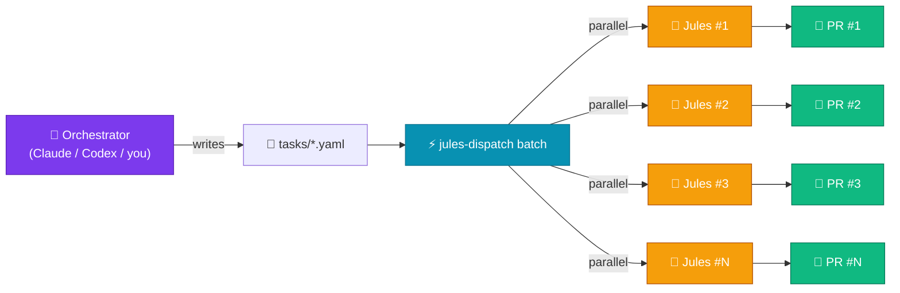
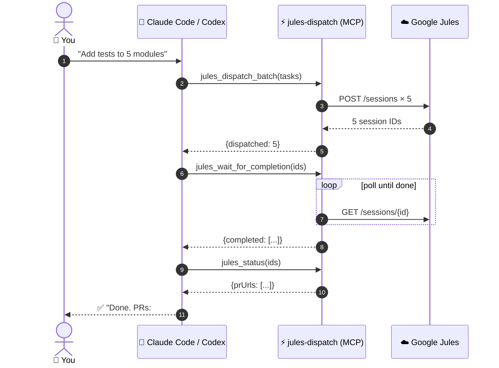
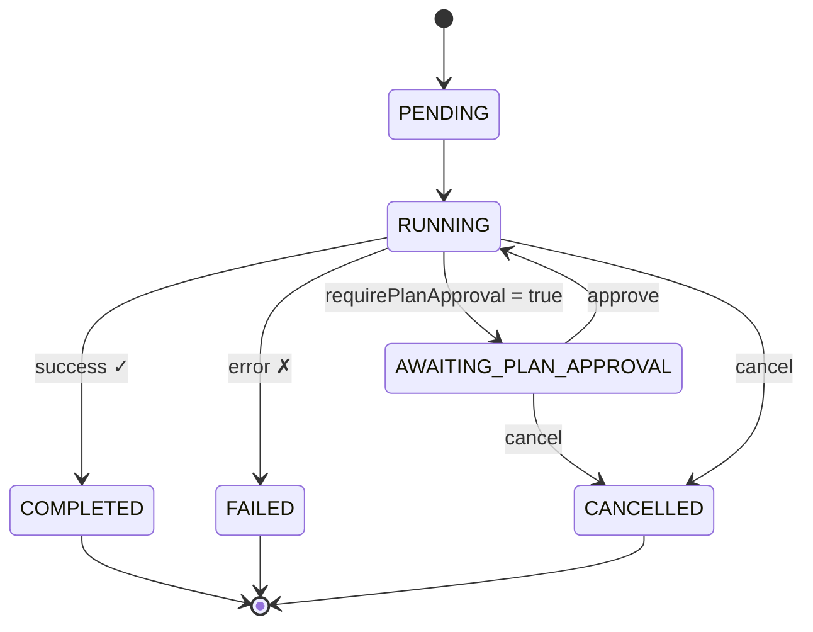

# jules-dispatch 🚀

> **Batch-dispatch tasks to [Google Jules](https://jules.google.com/) in parallel — and use it as an MCP tool inside [Claude Code](https://docs.anthropic.com/en/docs/claude-code) or [OpenAI Codex CLI](https://github.com/openai/codex).**

[](https://www.npmjs.com/package/jules-dispatch)
[](https://www.typescriptlang.org/)
[](https://modelcontextprotocol.io/)
[](LICENSE)

🌐 **Languages**: **English** · [简体中文](README.zh-CN.md)

<p align="center">
  
</p>

> **🌐 精美落地页 & 交互式文档**  
> [https://yuuqq.github.io/jules-dispatch/](https://yuuqq.github.io/jules-dispatch/) — 专业设计、完整上手指南、MCP 集成示例

---

## What Is This?

**jules-dispatch** is a CLI **and** an [MCP server](https://modelcontextprotocol.io/) for the [Google Jules API](https://jules.google.com/) that lets you:

- Fire off **10–100 Jules coding sessions in parallel** with a single command
- Define tasks as simple **YAML files** — title, repo, branch, prompt
- **Poll for completion** and collect generated PR links
- Approve plans, send follow-up messages, cancel runaway sessions, tail live activity
- Plug into **Claude Code** or **Codex** as an MCP server — your AI assistant calls Jules as a tool

It turns Jules from a "one task at a time" tool into a **massively parallel coding workforce**, controlled by either humans on the CLI or other AIs over MCP.

---

## 🏗 How It Works



---

## ✨ What's New in 1.2 — Optional AI Task Planning (BYO LLM)

> **Entirely optional.** All core commands work without any LLM key. Skip this section if you only want raw dispatch.

Stop hand-writing task YAML. Give jules-dispatch **one sentence** and let an LLM expand it into N parallel Jules sessions.

```bash
$ jules-dispatch auto "Migrate every Express route to Fastify and add request-validation tests"

Planning with gpt-4o-mini...

Planned 6 task(s):
  1. Migrate auth routes (/api/auth/*) to Fastify
  2. Migrate user routes (/api/users/*) to Fastify
  3. Migrate billing routes (/api/billing/*) to Fastify
  4. Replace Express middleware with Fastify hooks
  5. Update server bootstrap to use Fastify instance
  6. Add Vitest request-validation tests for all migrated routes

Dispatch all 6 task(s)? [y/N]
```

**Bring your own LLM** — works with any OpenAI-compatible `/chat/completions` endpoint:

| Provider | `LLM_BASE_URL` | Example `LLM_MODEL` |
|---|---|---|
| **OpenAI** (default) | *(omit — defaults to `https://api.openai.com/v1`)* | `gpt-4o-mini`, `gpt-4o`, `o3-mini` |
| **OpenRouter** | `https://openrouter.ai/api/v1` | `openrouter/auto`, `anthropic/claude-opus-4.7` |
| **Ollama** (local, free) | `http://localhost:11434/v1` | `llama3.1`, `qwen2.5-coder:32b` |
| **Groq** | `https://api.groq.com/openai/v1` | `llama-3.3-70b-versatile` |
| **Together / Fireworks / DeepInfra / vLLM / LiteLLM / Azure OpenAI** | *(their endpoint)* | *(their model id)* |

Configure via env vars (`LLM_API_KEY`, `LLM_BASE_URL`, `LLM_MODEL`) or per-invocation flags (`--llm-key`, `--llm-base-url`, `--llm-model`). `OPENAI_API_KEY` and `OPENROUTER_API_KEY` are also recognised as fallbacks.

| Command / Tool | What it does |
|---|---|
| `jules-dispatch plan-tasks "<intent>"` | Plan only — print or write tasks to a YAML file |
| `jules-dispatch auto "<intent>"` | Plan + dispatch in one shot (with confirmation) |
| MCP `jules_plan_tasks` | Same planning, exposed to Claude Code / Codex *(only registered if an LLM key is configured)* |
| MCP `jules_auto` | One-shot plan + dispatch *(only registered if an LLM key is configured)* |

---

## ✨ What's New in 1.1

- 🧰 **MCP server** (`jules-dispatch mcp`) — 12 tools exposed to Claude Code, Codex, or any MCP-compatible client
- 🤖 **`--json` mode** — machine-readable output on every command for AI agents and shell pipelines
- ✅ **Plan approval workflow** — `plan`, `approve` commands + `requirePlanApproval: true` task option
- 📡 **Live tailing** — `tail <id>` streams activity events as they happen
- ❌ **Cancel sessions** — `cancel <id>` aborts runaway runs
- 🔍 **Direct lookup** — `get <id>`, `status --ids` no longer limited to the recent page
- 🛡️ **Real failure detection** — uses session.state, fails fast, distinct exit codes
- ⚡ **Smart retries** — exponential backoff with jitter, honours `Retry-After`
- 📥 **Stdin input** — `dispatch -` reads YAML/JSON from a pipe
- 🔑 **`--api-key` flag** — pass keys per-invocation, no .env required

---

## ✨ Key Features

| Feature | Details |
|---|---|---|
| ⚡ Parallel dispatch | Saturate Jules with N sessions at once (`--parallel 20`) |
| 📋 YAML task files | Multi-document YAML supported (`---` separators) |
| 🔄 Status polling | Auto-detects PRs, plan approvals, failures |
| 💬 Plan & message control | Approve plans, send follow-up messages, cancel sessions |
| 🤖 MCP server | Drop into Claude Code or Codex as a tool |
| 📦 Structured output | `--json` mode for clean piping into agents and scripts |
| 📝 Dispatch logs | JSON audit trail of every dispatch run |

---

## 🤖 Use Inside Claude Code or Codex (MCP)

The MCP server exposes Jules as a set of tools your coding AI can call directly.



### Install for Claude Code

```bash
npm install -g jules-dispatch
```

> **Full setup guide** (including GSD integration): [docs/MCP-INTEGRATION.md](docs/MCP-INTEGRATION.md)

Add to `~/.config/claude-code/mcp.json` (or use `claude mcp add`):

```json
{
  "mcpServers": {
    "jules-dispatch": {
      "command": "jules-dispatch",
      "args": ["--project", "/path/to/your/project", "mcp"],
      "env": {
        "JULES_API_KEY": "your-api-key-here",
        "JULES_DEFAULT_SOURCE": "sources/github/owner/repo",
        "JULES_DEFAULT_BRANCH": "main"
      }
    }
  }
}
```

Then in Claude Code: *"Dispatch 5 Jules tasks to add tests to the auth, payments, users, sessions, and audit modules."* — Claude calls `jules_dispatch_batch` and reports back the session IDs.

### Install for OpenAI Codex CLI

Add to `~/.codex/config.toml`:

```toml
[mcp_servers.jules-dispatch]
command = "jules-dispatch"
args = ["--project", "/path/to/your/project", "mcp"]
env = { JULES_API_KEY = "your-api-key-here", JULES_DEFAULT_SOURCE = "sources/github/owner/repo" }
```

### Install as an Agent Skill

This repository also ships a lightweight skill wrapper at `skills/jules-dispatch/`. The skill teaches Claude Code, Codex, or any Agent Skills-compatible host when and how to use the `jules-dispatch` MCP tools.

For Codex, copy or install the folder as `jules-dispatch` in your Codex skills directory, then restart Codex:

```bash
cp -R skills/jules-dispatch "${CODEX_HOME:-$HOME/.codex}/skills/jules-dispatch"
```

For Agent Skills-compatible hosts that use a shared skills directory, copy the same folder into that host's skills directory. The skill is only the instruction layer; you still need the MCP server configured with `jules-dispatch mcp` and a valid `JULES_API_KEY`.

### MCP Tools Exposed

#### Consolidated tools (recommended)

These 3 tools handle all common workflows. Legacy tools (12 aliases) still work but are deprecated.

##### `jules_dispatch` — Create one or more sessions

Accepts a single task object, an array of tasks, or a YAML/JSON string.

**Parameters:**

| Parameter | Type | Required | Default | Description |
|---|---|---|---|---|
| `tasks` | `object \| object[] \| string` | **Yes** | — | Task definition(s). Objects need `title` + `prompt`. Strings are parsed as YAML/JSON. |
| `format` | `"yaml" \| "json"` | No | `"yaml"` | Format when `tasks` is a string |
| `parallel` | `number` | No | `10` | Max concurrent dispatches (1–50) |

```json
{
  "tasks": [
    { "title": "Fix auth bug", "prompt": "Fix the null check in login()" },
    { "title": "Add tests", "prompt": "Add unit tests for auth.ts" }
  ],
  "parallel": 5
}
```

##### `jules_monitor` — Check status or wait for completion

**Parameters:**

| Parameter | Type | Required | Default | Description |
|---|---|---|---|---|
| `sessionIds` | `string[]` | **Yes** | — | Session IDs to monitor |
| `wait` | `boolean` | No | `false` | If true, poll until all sessions reach a terminal state |
| `intervalMs` | `number` | No | `10000` | Poll interval in ms (min 1000) |
| `timeoutMs` | `number` | No | `600000` | Max wait time in ms (min 1000) |
| `failFast` | `boolean` | No | `false` | Exit immediately on first failure |

```json
{
  "sessionIds": ["abc123", "def456"],
  "wait": true,
  "timeoutMs": 300000
}
```

##### `jules_interact` — Inspect a session in full context

Returns session details, derived status, latest plan, activity timeline, and PR output in one call.

**Parameters:**

| Parameter | Type | Required | Default | Description |
|---|---|---|---|---|
| `sessionId` | `string` | **Yes** | — | Session ID to inspect |
| `activityCount` | `number` | No | `10` | Number of recent activities (1–100) |

```json
{ "sessionId": "abc123", "activityCount": 20 }
```

#### Utility tools

| Tool | Parameters | Description |
|---|---|---|
| `jules_list_sources` | *(none)* | List all GitHub repos connected to Jules |
| `jules_list_sessions` | `pageSize?`, `pageToken?` | List recent sessions with pagination |
| `jules_approve_plan` | `sessionId` | Approve a plan-gated session |
| `jules_send_message` | `sessionId`, `text` | Send a follow-up message |
| `jules_cancel_session` | `sessionId` | Cancel a running session |

#### Optional LLM-powered tools (requires LLM key)

| Tool | Parameters | Description |
|---|---|---|
| `jules_plan_tasks` | `description`, `maxTasks?`, `source?`, `branch?`, `context?` | Plan tasks from a high-level description |
| `jules_auto` | `description`, `maxTasks?`, `source?`, `branch?`, `parallel?` | Plan + dispatch in one shot |

#### Response format

All tools return:
```json
{ "success": true, "data": { ... } }
```

Errors return:
```json
{
  "success": false,
  "error": {
    "message": "Authentication failed",
    "status": 401,
    "name": "Error",
    "recovery_hint": "Check your API key"
  }
}
```

#### Legacy tools (deprecated aliases)

`jules_dispatch_task`, `jules_dispatch_batch`, `jules_get_session`, `jules_list_activities`, `jules_get_plan`, `jules_status`, `jules_wait_for_completion` — all still functional, redirect to consolidated tools internally.

---

## 🚀 Quick Start (Plain CLI)

### Prerequisites

- Node.js 20+
- A [Google Jules](https://jules.google.com/) account and API key
- A GitHub repository connected to Jules

### 1. Install

```bash
npm install -g jules-dispatch
```

### 2. Set up (interactive wizard)

```bash
jules-dispatch init
```

The wizard prompts for your API key, default source, and branch. It writes a `.env` file.

For CI/scripts (non-interactive):
```bash
jules-dispatch init --api-key sk-xxx --source sources/github/owner/repo
```

### 3. Validate your setup

```bash
jules-dispatch doctor
```

### 4. Write a task

```yaml
# tasks/add-dark-mode.yaml
title: "Add Dark Mode Support"
prompt: |
  Add a ThemeContext with light/dark state
  2. Wrap App with ThemeProvider
  3. Add a toggle button in the Header
  4. Persist preference in localStorage
  5. Open a PR
```

### 5. Dispatch it

```bash
jules-dispatch dispatch tasks/add-dark-mode.yaml
# ✓ Add Dark Mode Support
#   Session: https://jules.google.com/session/abc123
#   ID:      abc123
```

### 6. Batch-dispatch a whole directory

```bash
jules-dispatch batch tasks/ --parallel 10
```

That's it — 6 steps from install to your first PR.

---

## 📖 CLI Reference

### Global flags

| Flag | Default | Description |
|---|---|---|
| `-p, --project <dir>` | `.` | Directory containing your `.env` file |
| `--api-key <key>` |   | Jules API key (overrides `JULES_API_KEY`) |
| `--json` | off | Machine-readable output. NDJSON for streaming commands. |

### Commands

| Command | What it does |
|---|---|---|
| `init` | Interactive first-run wizard (API key, source, branch) |
| `dispatch <taskFile>` | Dispatch a single task. Use `-` to read from stdin. |
| `batch [taskDir]` | Dispatch all `.yaml`/`.yml`/`.json` files in a directory |
| `auto <description>` | LLM-plan + dispatch in one shot (with confirmation) |
| `plan-tasks <description>` | Use LLM to expand an intent into N task drafts (no dispatch) |
| `status` | Summary of recent sessions (or specific `--ids`) |
| `get <sessionId>` | Full details of one session |
| `wait <ids...>` | Poll until sessions finish (or timeout) |
| `tail <sessionId>` | Live-stream activity events for a session |
| `plan <sessionId>` | Show the most recent generated plan |
| `approve <sessionId>` | Approve a pending plan |
| `message <sessionId> <text>` | Send a follow-up message |
| `cancel <sessionId>` | Cancel a running session |
| `sources` | List connected GitHub repos (auto-paginates) |
| `doctor` | Validate environment, API key, connectivity, task files |
| `mcp` | Run as an MCP server over stdio |

### Exit codes (for shell scripts and agents)

| Code | Meaning |
|---|---|---|
| `0` | Success |
| `1` | Generic error |
| `2` | Auth / config error (missing API key) |
| `3` | Validation error (bad task file, bad args) |
| `4` | Partial failure (some `batch` tasks failed) |
| `5` | Timeout (`wait` ran out of time) |

### `dispatch` examples

```bash
# Override repo/branch
jules-dispatch dispatch tasks/my-task.yaml \
  --source sources/github/org/other-repo --branch develop

# Read from stdin
echo 'title: Quick fix\nprompt: Fix typo in README' | jules-dispatch dispatch -

# JSON output (great for piping)
jules-dispatch dispatch tasks/my-task.yaml --json | jq -r('.sessionId')
```

### `batch` examples

```bash
jules-dispatch batch tasks/                       # default tasks/ dir
jules-dispatch batch tasks/ --parallel 20         # 20 concurrent
jules-dispatch batch tasks/ --no-log              # don't write dispatch log
jules-dispatch batch tasks/ --json                # one JSON summary at the end
```

### `wait` example

```bash
# Chain dispatch → wait via JSON output:
ID=$(jules-dispatch dispatch tasks/x.yaml --json | jq -r('.sessionId')
jules-dispatch wait "$ID" --interval 10000 --timeout 1800000
```

### `tail` example

```bash
jules-dispatch tail abc123                        # human-readable stream
jules-dispatch tail abc123 --json                 # NDJSON event stream
```

---

## 🔄 Session Lifecycle

jules-dispatch tracks every Jules session through its full lifecycle and surfaces each state through the CLI / MCP:



| State | CLI command | MCP tool |
|---|---|---|
| `AWAITING_PLAN_APPROVAL` | `plan` / `approve` | `jules_get_plan` / `jules_approve_plan` |
| `RUNNING` | `tail` / `message` | `jules_list_activities` / `jules_send_message` |
| `COMPLETED` | `get` / `status` | `jules_get_session` / `jules_status` |
| `FAILED` / `CANCELLED` | `cancel` | `jules_cancel_session` |

---

## 📄 Task File Format

### Field Reference

| Field | Type | Required | Default | Description |
|---|---|---|---|---|
| `title` | `string` | **Yes** | — | Human-readable task name shown in CLI status and session lists |
| `prompt` | `string` | **Yes** | — | Detailed instructions for the Jules agent. The more specific, the better the output. |
| `source` | `string` | No | `JULES_DEFAULT_SOURCE` from `.env` | Jules source identifier, e.g. `sources/github/owner/repo`. Override per-task. |
| `branch` | `string` | No | `JULES_DEFAULT_BRANCH` from `.env` (or `main`) | Git branch for the Jules session to start from |
| `autoMode` | `string` | No | `AUTO_CREATE_PR` | Automation mode. Values: `AUTO_CREATE_PR` (Jules creates a PR automatically), `NONE` |
| `requirePlanApproval` | `boolean` | No | `false` | When `true`, Jules pauses after generating a plan and waits for `jules-dispatch approve <id>` |

### YAML example

```yaml
title: "Add unit tests for auth module"
prompt: |
  Add comprehensive unit tests for src/auth.ts:
  1. Test login with valid credentials
  2. Test login with invalid credentials
  3. Test token refresh flow
  4. Test session expiry handling
  5. Open a PR with the test file
source: "sources/github/myorg/myrepo"
branch: "develop"
autoMode: "AUTO_CREATE_PR"
requirePlanApproval: false
```

### Multiple tasks in one file (YAML `---` separators)

```yaml
title: "Fix lint errors in src/auth"
prompt: "Fix all ESLint errors in src/auth.ts"
---
title: "Fix lint errors in src/api"
prompt: "Fix all ESLint errors in src/api.ts"
---
title: "Fix lint errors in src/utils"
prompt: "Fix all ESLint errors in src/utils.ts"
```

### JSON format

```json
{
  "title": "Fix the thing",
  "prompt": "Find the bug in src/auth.ts and fix it.",
  "source": "sources/github/owner/repo",
  "branch": "main"
}
```

JSON array (for batch dispatch via MCP):

```json
[
  { "title": "Task 1", "prompt": "Do thing A" },
  { "title": "Task 2", "prompt": "Do thing B" }
]
```

---

## 🤖 AI-Orchestrated Parallel Development

The killer use case: combine jules-dispatch with **Claude Code** or **Codex**.

> *"I have a Node.js backend that needs to be migrated from Express to Fastify. Analyse the codebase, split the work into independent migration units, and dispatch them all to Jules in parallel using the jules-dispatch MCP tools. Then poll for completion and report back the PR URLs."*

With the MCP server installed, your assistant will:

1. Analyse your codebase
2. Call `jules_dispatch_batch` with N task definitions
3. Call `jules_wait_for_completion` to block until they finish
4. Call `jules_status` to extract the PR URLs

You get **N parallel coding agents** orchestrated by **one strategic agent**, hands-free.

---

## 📁 Project Structure

```
jules-dispatch/
├── src/
│   ├── cli.ts          CLI entry point (Commander)
│   ├── client.ts       Jules REST client (retries, pagination)
│   ├── config.ts       .env + task file loading
│   ├── dispatcher.ts   Task dispatch logic
│   ├── collector.ts    Status polling & wait
│   ├── errors.ts       Structured error translation (Problem/Cause/Fix)
│   ├── output.ts       Text vs JSON output mode, color detection
│   ├── init.ts         Interactive init wizard
│   ├── doctor.ts       Environment validation (doctor command)
│   ├── mcp.ts          MCP server (stdio transport, 14 tools)
│   ├── mcp-helpers.ts  MCP response helpers (ok/fail/recovery hints)
│   ├── polling.ts      Shared poll-with-callback engine
│   ├── planner.ts      Optional LLM task planner
│   ├── log.ts          Verbose logging
│   └── types.ts        TypeScript types
├── tasks/              Your task YAMLs live here
├── .env                Generated by jules-dispatch init
└── .dispatch-logs/     JSON audit trail
```

---

## 🛠 Development

```bash
npm install
npm run build     # compile TypeScript → dist/
npm run dev       # run CLI directly with tsx
npm run lint
npm run test
```

---

## 📜 License

MIT — see [LICENSE](LICENSE)

---

*Built to make [Google Jules](https://jules.google.com/) actually scale.*
