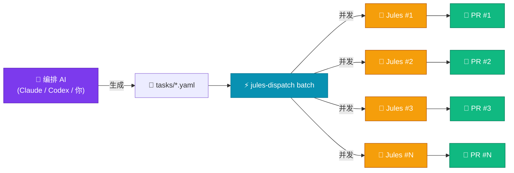
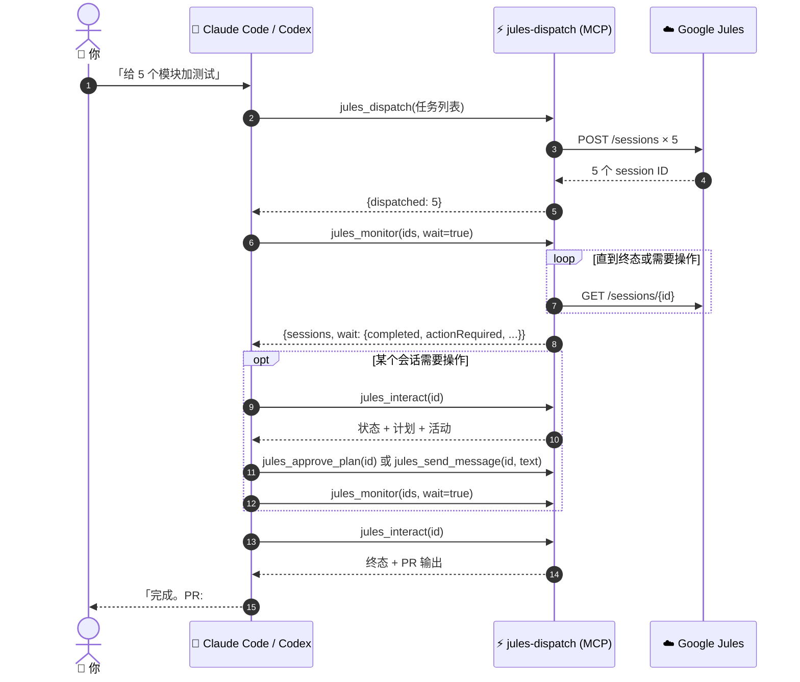
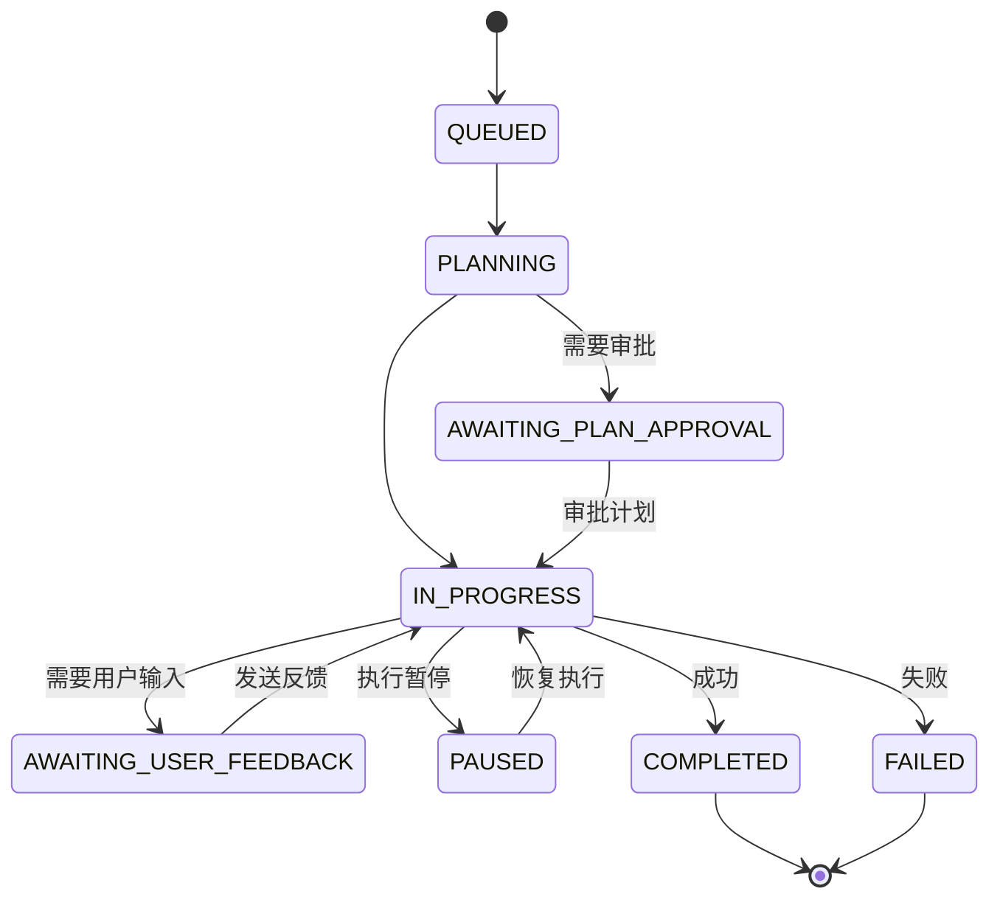

# jules-dispatch 🚀

> **批量并发派发任务到 [Google Jules](https://jules.google.com/)，并作为 MCP 工具直接接入 [Claude Code](https://docs.anthropic.com/en/docs/claude-code) 和 [OpenAI Codex CLI](https://github.com/openai/codex)。**

[](https://www.npmjs.com/package/jules-dispatch)
[](https://www.typescriptlang.org/)
[](https://modelcontextprotocol.io/)
[](LICENSE)

🌐 **Languages**: [English](README.md) · **简体中文**

<p align="center">
  
</p>

---

## 这是什么？

**jules-dispatch** 是 [Google Jules API](https://jules.google.com/) 的 CLI **以及** [MCP 服务器](https://modelcontextprotocol.io/)，它让你可以：

- 用一条命令并发触发 **10–100 个 Jules 编码会话**
- 用简单的 **YAML 文件**定义任务（标题、仓库、分支、提示词）
- **轮询完成状态**并自动收集生成的 PR 链接
- 审批计划、追加消息、取消失控会话、实时跟踪活动
- 接入 **Claude Code** 或 **Codex** 作为 MCP 服务器——你的 AI 助手把 Jules 当工具调用

它把 Jules 从「一次只能跑一个任务」变成由你（或别的 AI）指挥的**大规模并行编码工作流**。

---

## 🏗 它是怎么工作的



---

## ✨ 1.2 版本新特性 — 可选的 AI 任务规划（自带 LLM）

> **完全可选**。所有核心命令不需要任何 LLM key 就能用。只想用原始派发功能的可以跳过本节。

不用再手写任务 YAML。给 jules-dispatch **一句话**，让 LLM 自动展开成 N 个并发 Jules 会话。

```bash
$ jules-dispatch auto "把所有 Express 路由迁移到 Fastify 并补上请求校验测试"

Planning with gpt-4o-mini...

规划出 6 个任务：
  1. 迁移 auth 路由 (/api/auth/*) 到 Fastify
  2. 迁移 user 路由 (/api/users/*) 到 Fastify
  3. 迁移 billing 路由 (/api/billing/*) 到 Fastify
  4. 用 Fastify hooks 替换 Express middleware
  5. 重写 server 启动脚本以使用 Fastify 实例
  6. 给所有迁移后的路由加 Vitest 请求校验测试

Dispatch all 6 task(s)? [y/N]
```

**自带 LLM** — 兼容任何 OpenAI 协议的 `/chat/completions` 接口：

| 提供商 | `LLM_BASE_URL` | `LLM_MODEL` 示例 |
|---|---|---|
| **OpenAI**（默认） | *(留空 — 默认 `https://api.openai.com/v1`)* | `gpt-4o-mini`、`gpt-4o`、`o3-mini` |
| **OpenRouter** | `https://openrouter.ai/api/v1` | `openrouter/auto`、`anthropic/claude-opus-4.7` |
| **Ollama**（本地，免费） | `http://localhost:11434/v1` | `llama3.1`、`qwen2.5-coder:32b` |
| **Groq** | `https://api.groq.com/openai/v1` | `llama-3.3-70b-versatile` |
| **Together / Fireworks / DeepInfra / vLLM / LiteLLM / Azure OpenAI** | *(各自端点)* | *(各自模型 id)* |

通过环境变量配置（`LLM_API_KEY`、`LLM_BASE_URL`、`LLM_MODEL`）或命令行参数（`--llm-key`、`--llm-base-url`、`--llm-model`）。`OPENAI_API_KEY` 和 `OPENROUTER_API_KEY` 也作为回退被识别。

| 命令 / 工具 | 作用 |
|---|---|
| `jules-dispatch plan-tasks "<意图>"` | 只规划，打印或写入 YAML 文件 |
| `jules-dispatch auto "<意图>"` | 规划 + 派发一气呵成（带确认提示） |
| MCP `jules_plan_tasks` | 同样的规划能力，暴露给 Claude Code / Codex *（只有配置了 LLM key 才会注册）* |
| MCP `jules_auto` | 一步到位的「规划+派发」 *（只有配置了 LLM key 才会注册）* |

---

## ✨ 1.1 版本新特性

- 🧰 **MCP 服务器**（`jules-dispatch mcp`）— 始终注册 15 个工具；配置 LLM key 后再增加 2 个可选规划工具
- 🤖 **`--json` 模式** — 每个命令输出机器可读的结构化数据，便于 AI agent 和 shell 管道使用
- ✅ **计划审批工作流** — `plan`、`approve` 命令 + 任务级 `requirePlanApproval: true` 选项
- 📡 **实时追踪** — `tail <id>` 流式打印活动事件
- ❌ **取消会话** — `cancel <id>` 终止失控运行
- 🔍 **直接查询** — `get <id>`、`status --ids` 不再受最近一页的限制
- 🛡️ **真正的失败检测** — 使用 `session.state` 字段，支持快速失败、独立退出码
- ⚡ **智能重试** — 指数退避 + 抖动，遵循 `Retry-After` 响应头
- 📥 **stdin 输入** — `dispatch -` 从管道读取 YAML/JSON
- 🔑 **`--api-key` 参数** — 按调用传 key，无需 `.env`

---

## ✨ 核心特性

| 特性 | 说明 |
|---|---|
| ⚡ 并发派发 | 一条命令触发 N 个会话（`--parallel 20`） |
| 📋 YAML 任务文件 | 支持多文档 YAML（`---` 分隔符） |
| 🔄 状态轮询 | 自动检测 PR、计划审批、失败 |
| 💬 计划与消息控制 | 审批计划、追加消息、取消会话 |
| 🤖 MCP 服务器 | 接入 Claude Code 或 Codex 作为工具 |
| 📦 结构化输出 | `--json` 模式可干净地接入 agent 和脚本 |
| 📝 派发日志 | 每次运行的 JSON 审计记录 |

---

## 🤖 在 Claude Code 或 Codex 里使用（MCP）

MCP 服务器把 Jules 暴露成一组工具，让你的编码 AI 直接调用。



### 配置 Claude Code

```bash
npm install -g jules-dispatch
```

> **完整安装指南**（含 GSD 集成）：[docs/MCP-INTEGRATION.md](docs/MCP-INTEGRATION.md)

加入 `~/.config/claude-code/mcp.json`（或用 `claude mcp add`）：

```json
{
  "mcpServers": {
    "jules-dispatch": {
      "command": "jules-dispatch",
      "args": ["--project", "/path/to/your/project", "mcp"],
      "env": {
        "JULES_API_KEY": "your-api-key-here",
        "JULES_DEFAULT_SOURCE": "sources/github/owner/repo",
        "JULES_DEFAULT_BRANCH": "main"
      }
    }
  }
}
```

接下来在 Claude Code 里直接说：*「派 5 个 Jules 任务，分别给 auth、payments、users、sessions、audit 模块加测试。」* Claude 会调用 `jules_dispatch`，用 `jules_monitor` 监控，并在需要完整上下文或 PR 输出时调用 `jules_interact`。

### 配置 OpenAI Codex CLI

加入 `~/.codex/config.toml`：

```toml
[mcp_servers.jules-dispatch]
command = "jules-dispatch"
args = ["--project", "/path/to/your/project", "mcp"]
env = { JULES_API_KEY = "your-api-key-here", JULES_DEFAULT_SOURCE = "sources/github/owner/repo" }
```

### 作为 Agent Skill 安装

本仓库也内置了一个轻量技能包装层：`skills/jules-dispatch/`。这个 skill 会告诉 Claude Code、Codex 或兼容 Agent Skills 的宿主在什么场景下使用 `jules-dispatch`，以及优先调用哪些 MCP 工具。

Codex 可以把该目录复制或安装为 `jules-dispatch` skill，然后重启 Codex：

```bash
cp -R skills/jules-dispatch "${CODEX_HOME:-$HOME/.codex}/skills/jules-dispatch"
```

对于使用共享 skills 目录的 Agent Skills 兼容宿主，把同一个目录复制到对应 skills 目录即可。注意：skill 只是指令层；实际执行仍需要配置 `jules-dispatch mcp` MCP 服务器，并提供有效的 `JULES_API_KEY`。

### 暴露的 MCP 工具

服务器始终注册 15 个工具：3 个推荐的聚合工具、5 个实用工具和 7 个已弃用别名。配置 LLM key 后会额外注册 2 个规划工具。

#### 聚合工具（推荐）

| 工具 | 功能 |
|---|---|
| `jules_dispatch` | 从单个任务、任务数组或 YAML/JSON 字符串创建一个或多个会话 |
| `jules_monitor` | 查询状态；`wait: true` 时等待到终态、需要操作或超时 |
| `jules_interact` | 一次获取会话详情、派生状态、最新计划、活动记录和 PR 输出 |

`jules_monitor` 遇到 `AWAITING_PLAN_APPROVAL`、`AWAITING_USER_FEEDBACK` 或 `PAUSED` 会返回，而不是继续等到完成。此时先用 `jules_interact` 查看上下文，按需调用 `jules_approve_plan` 或 `jules_send_message`，然后再次监控尚未解决的会话。

#### 实用工具

| 工具 | 功能 |
|---|---|
| `jules_list_sources` | 列出连接到 Jules 的 GitHub 仓库 |
| `jules_list_sessions` | 分页列出最近会话 |
| `jules_approve_plan` | 审批待审批的计划 |
| `jules_send_message` | 向会话发送补充说明或反馈 |
| `jules_cancel_session` | 取消会话 |

#### 可选 LLM 规划工具

| 工具 | 功能 |
|---|---|
| `jules_plan_tasks` | 用 OpenAI 兼容模型把高层意图展开成任务草稿 |
| `jules_auto` | 规划后直接并发派发 |

#### 已弃用别名

`jules_dispatch_task`、`jules_dispatch_batch`、`jules_get_session`、`jules_list_activities`、`jules_get_plan`、`jules_status`、`jules_wait_for_completion` 仍可使用，但新工作流应优先使用聚合工具。

所有工具都返回结构化 JSON。成功响应为 `{success: true, data: ...}`；错误以 MCP `isError` 形式返回，并包含结构化错误和恢复提示。

---

## 🚀 快速上手（普通 CLI）

### 前置要求

- Node.js 20+
- 一个 [Google Jules](https://jules.google.com/) 账号和 API key
- 一个连接到 Jules 的 GitHub 仓库

### 1. 安装

```bash
npm install
# 或全局安装：
npm install -g jules-dispatch
```

### 2. 配置

```bash
cp .env.example .env
```

```env
JULES_API_KEY=你的-api-key
JULES_DEFAULT_SOURCE=sources/github/你的组织/你的仓库
JULES_DEFAULT_BRANCH=main
JULES_AUTO_MODE=AUTO_CREATE_PR
```

### 3. 写一个任务

```yaml
# tasks/add-dark-mode.yaml
title: "添加深色模式"
prompt: |
  给这个 React 应用加一个深色模式开关：
  1. 添加包含 light/dark 状态的 ThemeContext
  2. 在 App 外层包一层 ThemeProvider
  3. 在 Header 组件中加一个切换按钮
  4. 用 localStorage 持久化偏好
  5. 提一个 PR
```

### 4. 派发

```bash
jules-dispatch dispatch tasks/add-dark-mode.yaml
# ✓ 添加深色模式
#   Session: https://jules.google.com/session/abc123
#   ID:      abc123
```

### 5. 或一次性批量派发整个目录

```bash
jules-dispatch batch tasks/ --parallel 10
```

---

## 📖 CLI 命令参考

### 全局参数

| 参数 | 默认 | 说明 |
|---|---|---|
| `-p, --project <dir>` | `.` | 包含 `.env` 的目录 |
| `--api-key <key>` |   | Jules API key（覆盖 `JULES_API_KEY`） |
| `--json` | 关 | 机器可读输出。流式命令输出 NDJSON |

### 命令

| 命令 | 功能 |
|---|---|
| `dispatch <taskFile>` | 派发单个任务文件，`-` 表示从 stdin 读取 |
| `plan-tasks <description>` | 用可选的 OpenAI 兼容 LLM 把一句话意图展开成 N 个任务草稿（不派发） |
| `auto <description>` | LLM 规划 + 派发一气呵成（带确认提示） |
| `batch [taskDir]` | 派发目录下所有 `.yaml`/`.yml`/`.json` 文件 |
| `status` | 查看最近会话摘要（或指定 `--ids`） |
| `get <sessionId>` | 查看单个会话完整详情 |
| `wait <ids...>` | 轮询直到会话进入终态、需要操作或超时 |
| `tail <sessionId>` | 实时流式打印会话活动 |
| `plan <sessionId>` | 显示会话最新生成的计划 |
| `approve <sessionId>` | 审批待审批的计划 |
| `message <sessionId> <text>` | 向会话追加一条消息 |
| `cancel <sessionId>` | 取消运行中的会话 |
| `sources` | 列出连接的 GitHub 仓库（自动分页） |
| `mcp` | 通过 stdio 启动 MCP 服务器 |

### 退出码（用于 shell 脚本和 agent）

| 码 | 含义 |
|---|---|
| `0` | 成功 |
| `1` | 通用错误 |
| `2` | 鉴权错误（API key 缺失或被拒绝） |
| `3` | 校验或配置错误（任务文件、参数或 Jules 设置无效） |
| `4` | 部分失败（`batch` 中部分任务失败） |
| `5` | 超时（`wait` 等待超时） |

### `dispatch` 示例

```bash
# 覆盖仓库 / 分支
jules-dispatch dispatch tasks/my-task.yaml \
  --source sources/github/org/other-repo --branch develop

# 从 stdin 读
echo 'title: 修复\nprompt: 修复 README 中的拼写错误' | jules-dispatch dispatch -

# JSON 输出（方便管道）
jules-dispatch dispatch tasks/my-task.yaml --json | jq -r '.sessionId'
```

### `batch` 示例

```bash
jules-dispatch batch tasks/                       # 默认 tasks/ 目录
jules-dispatch batch tasks/ --parallel 20         # 20 并发
jules-dispatch batch tasks/ --no-log              # 不写派发日志
jules-dispatch batch tasks/ --json                # 末尾输出一条 JSON 摘要
```

### `wait` 示例

```bash
# 通过 JSON 输出串接 dispatch → wait：
ID=$(jules-dispatch dispatch tasks/x.yaml --json | jq -r '.sessionId')
jules-dispatch wait "$ID" --interval 10000 --timeout 1800000
```

### `tail` 示例

```bash
jules-dispatch tail abc123                        # 人类可读流
jules-dispatch tail abc123 --json                 # NDJSON 事件流
```

---

## 🔄 会话生命周期

jules-dispatch 追踪每个 Jules 会话的完整生命周期，并在 CLI / MCP 里暴露每个状态：



| 官方状态 | 含义 | 建议操作 |
|---|---|---|
| `STATE_UNSPECIFIED` | API 未提供具体状态 | 用 `jules_monitor` 重查，或用 `jules_interact` 查看上下文 |
| `QUEUED` / `PLANNING` / `IN_PROGRESS` | Jules 正在推进任务 | 继续监控；需要实时活动时使用 `tail` |
| `AWAITING_PLAN_APPROVAL` | 生成的计划等待审批 | 用 `jules_interact` 审阅，再调用 `approve` / `jules_approve_plan` |
| `AWAITING_USER_FEEDBACK` | Jules 需要澄清或输入 | 查看上下文，再调用 `message` / `jules_send_message` |
| `PAUSED` | 执行暂停，需要关注 | 查看上下文，按需提供说明，然后再次监控 |
| `COMPLETED` | 成功终态 | 查看会话并收集 PR 输出 |
| `FAILED` | 失败终态 | 查看最新失败活动，再决定重试还是替换任务 |

为兼容旧版 API，jules-dispatch 也会归一化 `PENDING`、`RUNNING`、`AWAITING_USER_INPUT`、`CANCELLED` 和 `CANCELED`。取消操作通过 Jules 的 `DELETE /sessions/{id}` 发送。

---

## 📄 任务文件格式

```yaml
title: "可读的任务名"                          # 必填
prompt: |                                    # 必填
  给 Jules 的详细指令。
  越具体效果越好。

source: "sources/github/owner/repo"          # 可选，覆盖 .env 默认值
branch: "main"                               # 可选，覆盖 .env 默认值
autoMode: "AUTO_CREATE_PR"                   # 可选，AUTO_CREATE_PR | NONE
requirePlanApproval: false                   # 可选，暂停等待人工审批计划
```

**单文件多任务**（用 YAML `---` 分隔）：

```yaml
title: "任务 1"
prompt: "做 A"
---
title: "任务 2"
prompt: "做 B"
```

也支持 JSON：

```json
{ "title": "修这个 bug", "prompt": "找出 src/auth.ts 里的 bug 并修复" }
```

---

## 🤖 AI 编排的并行开发

最强用法：把 jules-dispatch 和 **Claude Code** 或 **Codex** 组合起来。

> *「我有一个 Node.js 后端要从 Express 迁到 Fastify。请分析代码库，把工作切分成相互独立的迁移单元，用 jules-dispatch MCP 工具并行派给 Jules，然后轮询完成情况、把所有 PR 链接报给我。」*

装好 MCP 服务器后，你的 AI 助手会：

1. 分析你的代码库
2. 提交并推送目标分支，因为 Jules 从远程源分支工作，无法看到尚未推送的本地修改
3. 调用 `jules_dispatch` 派发 N 个任务
4. 调用 `jules_monitor` 并设置 `wait: true`；若需要操作，就用 `jules_interact` 检查，再审批或发送反馈，然后继续监控
5. 用 `jules_interact` 收集终态上下文和 PR 链接

**N 个并行编码 agent + 1 个战略 agent 编排**，全程不用动手。

---

## 📁 项目结构

```
jules-dispatch/
├── src/
│   ├── cli.ts          CLI 入口（Commander）
│   ├── client.ts       Jules REST 客户端（重试、分页）
│   ├── config.ts       .env + 任务文件加载
│   ├── dispatcher.ts   任务派发逻辑
│   ├── collector.ts    状态轮询与等待
│   ├── output.ts       文本 / JSON 输出模式
│   ├── mcp.ts          MCP 服务器（15 个工具 + 2 个可选规划工具）
│   ├── tail.ts         有界、游标感知的活动追踪
│   └── types.ts        TypeScript 类型定义
├── tasks/              你的任务 YAML 放这里
├── .env.example        环境变量模板
└── .dispatch-logs/     JSON 审计日志
```

---

## 🛠 开发

```bash
npm install
npm run build     # 编译 TypeScript → dist/
npm run dev       # 用 tsx 直接运行 CLI
npm run lint
npm run test
```

---

## 📜 许可证

MIT — 见 [LICENSE](LICENSE)

---

*为让 [Google Jules](https://jules.google.com/) 真正能规模化而打造。*
